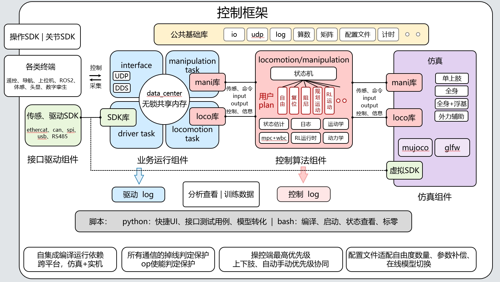

Copyright 2025 国地共建人形机器人创新中心/人形机器人（上海）有限公司, https://www.openloong.net/

# 简介

本仓库为OpenLoong控制框架各子组件目录。

OpenLoong控制框架特点：

* **完整且独立**：除与内核绑定的IGH ethercat主站外，自集成全部运行依赖，无需任何繁琐的环境依赖配置即可跑起机器人，离线测试、仿真验证、实机运行，具备完整功能的机器人控制程序库
* **干净而朴素**：免安装，免配环境，对系统零污染，ROS free，朴素c++实现，高性能通信与任务执行
* **隔离亦统一**：模块化开发，严封装，零飞针，功能易拓展，快速满足不同机器人平台间组合或移植。仿真-实机接口、操作一致，跨平台架构，一套代码完成验证+部署

# OpenLoong控制框架



### OpenLoong控制框架包含的仓库

| 库名称                                                                                 | 生成的动态库/可执行文件                                                                                   | 动态库/可执行文件放置                                                                                                                                                                    | 用途描述                                                                                   |
| -------------------------------------------------------------------------------------- | --------------------------------------------------------------------------------------------------------- | ---------------------------------------------------------------------------------------------------------------------------------------------------------------------------------------- | ------------------------------------------------------------------------------------------ |
| **[loong_utility](https://github.com/loongOpen/loong_utility.git)**                 | 无                                                                                                        | 无（基础库，被其他模块直接链接）                                                                                                                                                         | 提供C++基础功能库（算法/矩阵/日志/UDP等）                                                  |
| **[loong_driver_sdk](https://github.com/loongOpen/loong_driver_sdk.git)**           | **动态库**:<br>`libloong_driver_sdk_x64(a64).so`                                                     | **动态库**:<br>`loong_base/module/loong_driver_sdk` <br>`loong_deployment/module/loong_driver_sdk`                                                                                     | 传感驱动sdk（EtherCAT/485/IMU/灵巧手等硬件接口）                                           |
| **[loong_ctrl_locomotion](https://github.com/loongOpen/loong_ctrl_locomotion.git)** | **动态库**:<br>`libnabo_x64(a64).so`                                                                  | **动态库**:<br>`loong_base/module/nabo_locomotion` <br>`loong_sim/module/nabo_locomotion` <br>`loong_sim_sdk_release/module/nabo_locomotion` <br>`loong_deployment/module/nabo_locomotion` | 上层运动控制框架（状态机调度+全身关节控制算法）                                            |
| **[loong_base](https://github.com/loongOpen/loong_base.git)**                       | **可执行文件**:<br>`loong_driver_x64(a64)` <br>`loong_interface_x64(a64)` <br>`loong_locomotion_x64(a64)` | **可执行文件**:<br>`loong_sim_sdk_release/bin` <br>`loong_deployment/bin`                                                                                                              | 作为控制业务主程序，生成各个组件库调用的可执行文件。                                       |
| **[loong_sim](https://github.com/loongOpen/loong_sim.git)**                         | **可执行文件**:<br>`loong_share_sim_x64(a64)`                                                         | **可执行文件**:<br>`loong_sim_sdk_release/bin`                                                                                                                                       | 作为仿真环境。可独立验证loco、mani算法仿真，以及作为虚拟驱动底层联合loong_base作全链仿真。 |
| **[loong_sim_sdk_release](https://github.com/loongOpen/loong_sim_sdk_release.git)** | 无                                                                                                        | 无（已编译好的全链仿真sdk）                                                                                                                                                              | 已编译好的全链仿真sdk，模拟实机运行流程，附python调用接口示例。                            |
| **[loong_deploy](https://github.com/loongOpen/loong_deployment.git)**               | 无                                                                                                        | 无（已编译好的部署框架文件）                                                                                                                                                             | 已编译好的部署框架文件，拷贝到实机即可运行。                                               |

### 以上仓库按需下载即可，无需全部。

各链接均为独立仓库。若使用vscode同时打开会导致智能补全功能失效，各个仓库独立打开即可。

# 编译及运行

## 编译

在各个库的tools文件夹内提供了快捷脚本完成常用操作，执行其中make.sh即可完成编译（根据提示输入参数，以匹配不同架构或用途），编译成功后会各自生成nabo_output目录，保存了当前编译后的动态库/可执行文件。
当以上仓库位于同一目录层级时，执行make.sh编译成功后可自动拷贝生成文件至被依赖的目标处。或亦可按上表依赖关系手动拷贝。

## 算法仿真运行（loong_sim）

1.在loong_sim/tools下运行算法仿真脚本。

```bash
./run_mujoco_loco.sh
```

2.按键wasd控制前后左右，q键控制踏步，e键停止踏步。


## 全链仿真运行（loong_sim_sdk_release）

详见loong_sim_sdk_release/readme.md

### 另：

* [交叉编译环境配置.md](交叉编译环境.md)
* vsode部分配置.json
